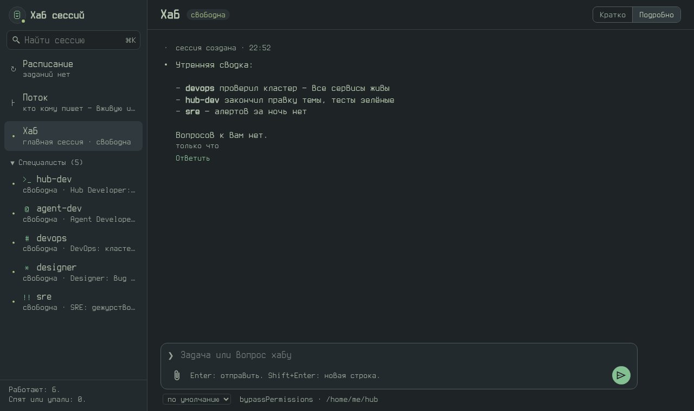
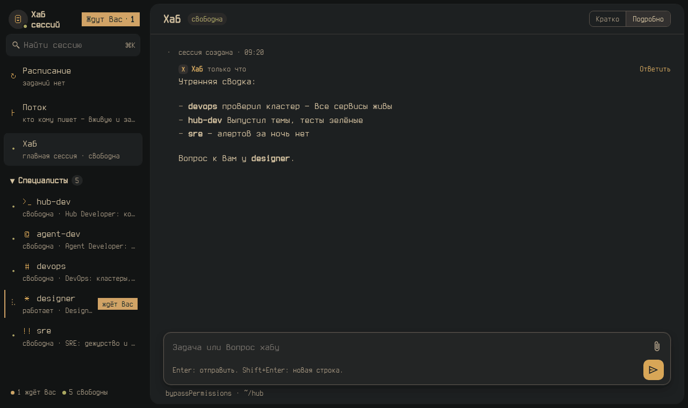

# Unix-терминал — темы Agents Hub

Две тёмные темы в духе терминалов 70–80-х годов. Выбор — «Настройки» → «Тема».

**Спокойный фосфор** — зелёная гамма по палитре Everforest:

**Спокойный янтарь** — янтарная гамма по палитре Gruvbox:

- Шрифт Terminus на всю страницу — лента, списки, код (`"font_scope": "all"`), крупнее на треть (`"font_scale"`):
  ровно 18px, как в консоли.
- Значки хаба и аватары агентов — пиксельные картинки знаков Terminus: ☺ ↻ ├ /, у агентов `>_` @ # !! *.

Нужен хаб с API плагинов 1.8 — поля шрифта на всю страницу и масштаба добавляет
[PR #28 в общий хаб](https://github.com/flagman/agents-hub-core/pull/28). На более старом тема встанет с пометкой «обновите хаб»: цвета и значки будут, а
Terminus — только в заголовках и мельче.

Шрифт Terminus — SIL OFL 1.1 (`themes/f/terminus-COPYING.txt`). JSON тем и картинки — MIT.
